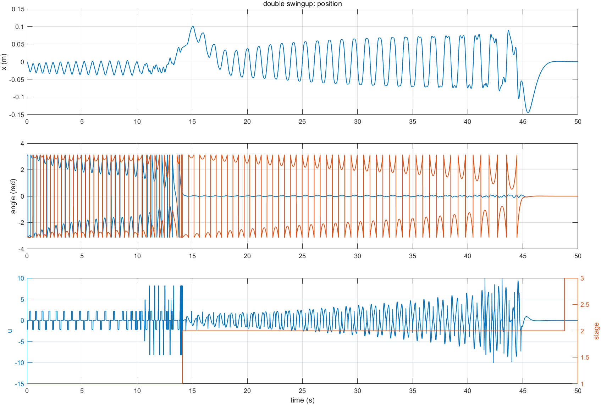
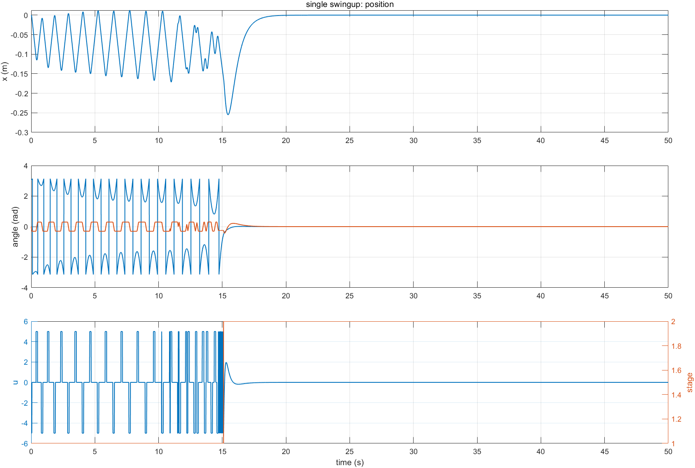
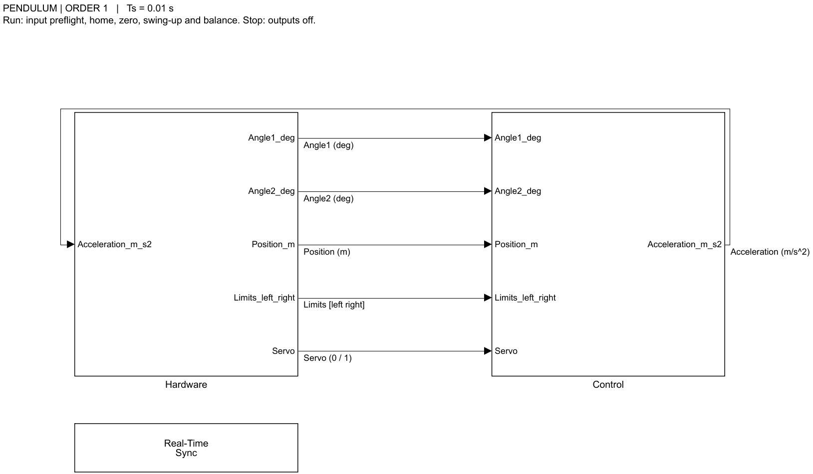
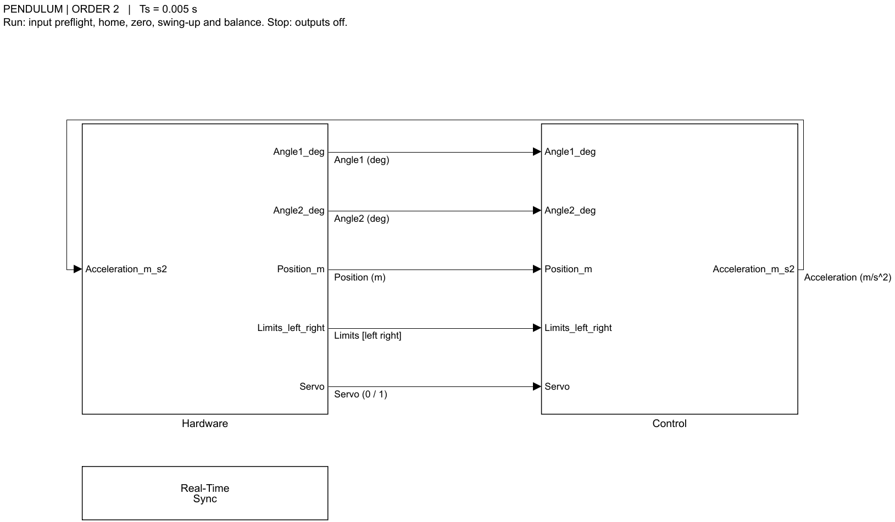

# PendulumLab

基于 MATLAB、Simulink 与 C++ 的一级/二级直线倒立摆实验平台，包含非线性动力学、能量摆起、分阶段切换、LQR 稳摆、离线仿真、实机控制和运行记录。

<p align="center">
  
</p>

## 项目特点

- 一级摆：能量摆起 → 四状态 LQR 稳摆
- 二级摆：一级杆摆起 → 二级杆摆起 → 六状态 LQR 稳摆
- MATLAB 数值积分与 Simulink 两套离线引擎
- 可编辑的原生 Simulink 实机控制图，以及独立 C++ 控制程序
- 自动回中、零点采集、物理限位、软件行程保护和安全停机
- 每次运行独立保存参数、轨迹和指标，方便复现

## 算法

### 一级倒立摆

状态为 `X = [x, θ, ẋ, θ̇]ᵀ`。摆杆远离直立位置时，控制器利用能量误差驱动小车往复运动；进入捕获区域后切换到四状态反馈：

```text
u = -KX
K = [-10, 58.6, -12.23, 10.69]
```

<p align="center">
  
</p>

### 二级倒立摆

状态为 `X = [x, θ₁, θ₂, ẋ, θ̇₁, θ̇₂]ᵀ`，完整控制分为三个阶段：

1. 能量控制摆起第一根杆。
2. 一级杆 LQR 保持第一根杆，同时向第二根杆泵入能量。
3. 两根杆进入捕获窗口后切换到六状态 LQR。

```text
u = -KX

K = [20.7556, 136.6846, -254.8584,
     24.4406,   3.3045,  -40.7504]
```

控制器同时包含阶段回退、输入饱和、轨道制动和积分抗饱和。

## 一分钟复现

```matlab
addpath('matlab');
setup_pendulum;

single_swing = run_pendulum('single','swingup');
single_hold  = run_pendulum('single','balance');
double_swing = run_pendulum('double','swingup');
double_hold  = run_pendulum('double','balance');

assert(all([single_swing.passed, single_hold.passed, ...
            double_swing.passed, double_hold.passed]));
```

默认使用快速 MATLAB 数值引擎。运行 Simulink 版本：

```matlab
r = run_pendulum('double','swingup',struct( ...
    'engine','simulink','show_ui',true));
```

运行完整验证：

```matlab
verify_pendulum();                       % 四个数值场景
verify_pendulum({'numeric','simulink'}); % 数值与 Simulink 对照
```

需要 MATLAB；Simulink 场景需要 Simulink，重新设计 LQR 需要 Control System Toolbox。

## Simulink 实机模型

<table>
  <tr>
    <td width="50%" align="center"><strong>一级实机控制图 · 100 Hz</strong></td>
    <td width="50%" align="center"><strong>二级实机控制图 · 200 Hz</strong></td>
  </tr>
  <tr>
    <td></td>
    <td></td>
  </tr>
</table>

实机模型已经封装硬件输入输出。算法使用者只需要打开：

- `matlab/native_simulink/Pendulum_Native_1.slx`
- `matlab/native_simulink/Pendulum_Native_2.slx`

然后修改 `Control` 内部：输入为角度1/角度2（度）、位置（m）、左右限位 `[left right]` 和自动使能状态 `Servo`；唯一输出为加速度（m/s²）。左侧 `Hardware` 负责回中标零、传感器换算、加速度到电压的速度环和输出保护。

> `pn_build` 会覆盖两份模型并恢复内置算法。`pn_verify()` 默认不重建，检查已保存模型的内置算法回归与接口保护；自定义算法不必满足内置算法数值回归。

## 实机运行

### 原生 Simulink

```matlab
start_pendulum_simulink(1) % 一级：100 Hz
start_pendulum_simulink(2) % 二级：200 Hz
```

只读硬件预检，不使能伺服：

```matlab
start_pendulum_simulink(1,'readonly',5)
start_pendulum_simulink(2,'readonly',5)
```

### MATLAB 独立实物入口

```matlab
start_pendulum    % 输入 1 或 2
start_pendulum(1) % 一级
start_pendulum(2) % 二级
```

### C++ 控制程序

```powershell
powershell -ExecutionPolicy Bypass -File .\start_pendulum.ps1
```

启动后输入 `1` 或 `2`，按 `Q` 或 `Esc` 停止。

> **安全提示：实机入口会使能伺服并移动设备。** 运行前确认轨道无障碍、物理限位与急停有效，并确保只有一个控制程序占用硬件。首次测试应有人值守。

## 结果与复现

每次离线运行都会在 `matlab/output/<模型>/` 下创建独立目录，保存参数、时间、状态、控制输入、运行指标和 MATLAB 版本。主要字段包括：

- `passed`：是否通过全部判据
- `settled`：末尾窗口是否稳定
- `max_abs_x`：最大轨道位移
- `max_abs_u`：最大控制输入
- `stage`：控制阶段轨迹
- `output_file`：本次可复现 MAT 文件

摆起场景还会检查是否访问全部必要阶段。

## 文档

- [原生 Simulink 实机控制说明](matlab/native_simulink/README.md)
- [MATLAB 离线仿真与算法说明](matlab/README.md)
- [MATLAB 实物迁移与硬件说明](matlab/hardware/README.md)
- [接线定义](docs/引脚定义.md)

## 目录结构

```text
PendulumLab/
├─ matlab/
│  ├─ single_pendulum/   一级动力学、控制器和模型
│  ├─ double_pendulum/   二级动力学、LQR、摆起和优化
│  ├─ native_simulink/   一级/二级实机 Simulink 控制图
│  ├─ hardware/          MATLAB 硬件适配与安全会话
│  └─ output/            可复现实验结果
├─ src/ + include/       独立 C++ 控制程序
├─ config/               C++ 硬件与控制配置
├─ docs/                 接线、调试说明和图片
└─ tests/                C++ 自动测试
```

## 推荐复现顺序

```text
阅读算法说明
→ 数值仿真
→ 全场景验证
→ Simulink 对照
→ 修改 Control
→ 只读硬件预检
→ 有限时间实机测试
```

先确认状态定义、单位、符号、采样周期和限幅一致，再连接真实执行器。
